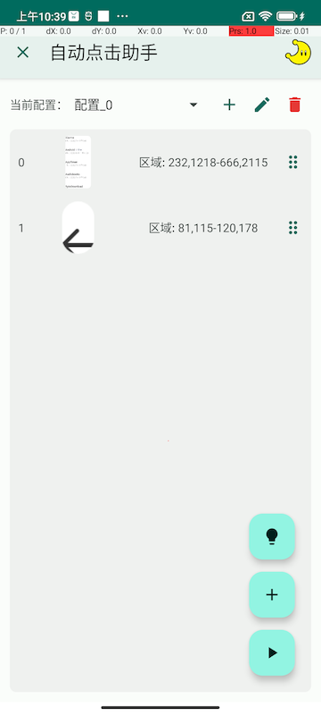
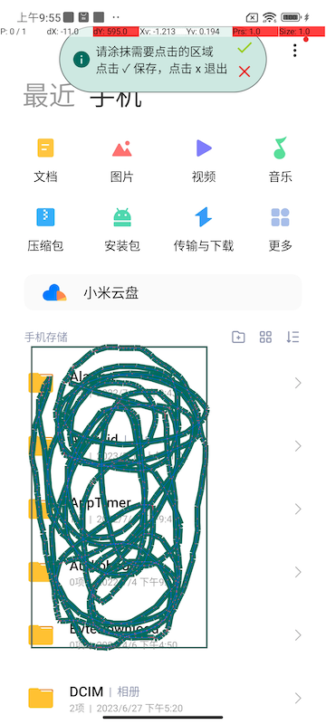
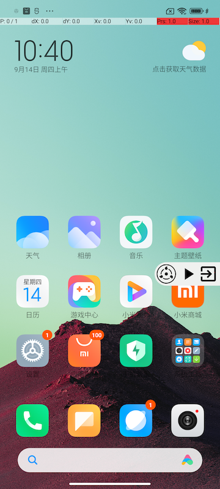

# AutoHelper

个人日常自动化工具

## 自动点击助手

玩阴阳师时写的刷御魂、刷活动用的挂机工具，小号刷本和大号补充樱饼不够的时候用，现在弃坑了，把功能、界面、逻辑优化了些，也算是个交代吧。

支持**多配置**，通过**添加截图、涂抹**创建`点击区域`，点击运行，根据实时屏幕截图判断点击区域，**
顺序点击**配置文件中的各个`点击区域`。

为了避免总是点击固定位置，被某些程序认为是外挂，尝试点击的位置为**涂抹区域中的随机点**。

### 截图/录屏演示

### 实现原理

后台服务每隔 1678ms 截图一次（暂不支持配置时间），对比图片相似度找到点击区域，通过无障碍服务模拟点击。

### 适用场景

需要循环点击大概位置区域的场景。

### 权限说明

1. 悬浮窗权限，用于绘制快捷菜单，方便开启、停止、退出。
2. 无障碍服务，仅使用了模拟点击功能。
3. 录屏/截屏权限，用于判断图片相似度找到点击区域。
4. 无网络权限，仅本地运行。

### 使用方法：

1. 新建配置
2. 选择手机图库中截图，涂抹需要识别并点击的区域，建议多涂抹，保证模拟点击时位置不容易重复
3. 点击运行，此时当前程序隐藏
4. 打开需要识别的目标程序
5. 点击悬浮窗，点击运行/停止

### ⚠️特别声明

**使用本程序风险自己承担，建议仅小段时间使用，不建议有外挂警告记录的账号使用。**

个人自用号一般使用时间在 1～2 个小时之内，未出现问题。

## Auto Job (暂时隐藏)

小伙伴写的自动拉起飞书签到的功能，用于一台测试机放在公司自动签到。